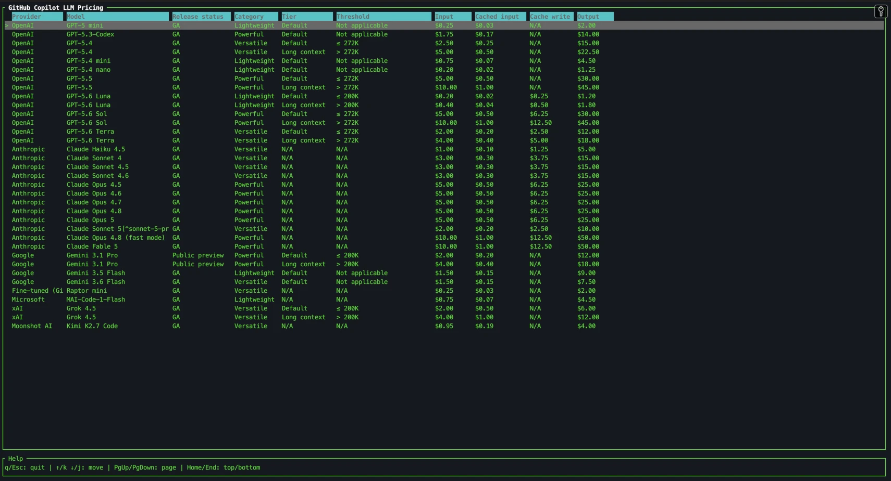

# GitHub LLM cost-table

A terminal UI tool that fetches [GitHub Copilot model pricing](https://docs.github.com/fr/copilot/reference/copilot-billing/models-and-pricing) and displays it as an interactive table.


## Install

Prebuilt binaries are available on the [Releases](https://github.com/ftison/github-llm-cost-table/releases) page.

### macOS (Apple Silicon)

```sh
curl -sL https://github.com/ftison/github-llm-cost-table/releases/latest/download/gh-llm-cost-table-v<VERSION>-aarch64-apple-darwin.tar.gz | tar xz
mv gh-llm-cost-table/gh_copilot_pricing_tui ~/.local/bin/
xattr -d com.apple.quarantine ~/.local/bin/gh_copilot_pricing_tui
```

### Linux (x86_64)

```sh
curl -sL https://github.com/ftison/github-llm-cost-table/releases/latest/download/gh-llm-cost-table-v<VERSION>-x86_64-unknown-linux-musl.tar.gz | tar xz
mv gh-llm-cost-table/gh_copilot_pricing_tui ~/.local/bin/
```

### Windows (x86_64)

Download `gh-llm-cost-table-v<VERSION>-x86_64-pc-windows-msvc.zip`, extract it and run `gh_copilot_pricing_tui.exe`.

Replace `<VERSION>` with the desired release tag (e.g. `v0.1.0`).

## Features

- Fetches the latest pricing table directly from GitHub Docs on every run.
- Parses multiple provider tables (OpenAI, Anthropic, Google, Microsoft, xAI, Moonshot AI, …).
- Interactive `ratatui` table with keyboard navigation.
- Strict Rust quality gates: clippy, rustfmt, no `unwrap`/`expect` in library code.

## Build

Requires the Rust toolchain pinned in `rust-toolchain.toml`.

```sh
cargo build --release
```

## Run

```sh
cargo run --release
```

## Controls

| Key | Action |
| --- | --- |
| `↑` / `↓` or `k` / `j` | Move selection up/down |
| `PgUp` / `PgDown` | Page up/down |
| `Home` / `End` | Go to top/bottom |
| `q` or `Esc` | Quit |

## Development

```sh
# Run tests
cargo test

# Run clippy (denies unwrap/expect/panic)
cargo clippy

# Check formatting
cargo fmt --check

# Apply formatting
cargo fmt
```

## Architecture

- `src/main.rs`: thin binary entry point, initializes tracing and wires fetch → parse → TUI.
- `src/lib.rs`: exposes `app`, `data`, `error`, and `ui` modules.
- `src/data/`: HTTP fetcher and Markdown table parser.
- `src/app/`: terminal lifecycle, event loop, rendering widgets, and application state.
- `src/error.rs`: typed errors used across the crate.
